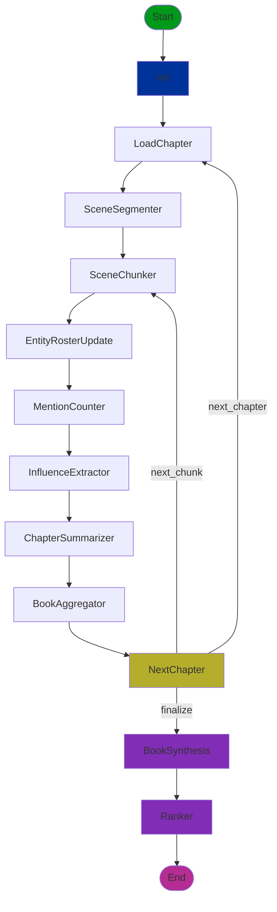

# Lit Anal, short for Literary Analysis - A LangGraph Book Character Influence Analyzer

A LangGraph-based system that processes books chapter-by-chapter to analyze and rank characters by their influence throughout the story.

## Overview

This system tracks:
- **Mentioned count**: Total times a character's name or aliases appear in the text
- **Influence evidence**: Structured evidence of causal, social, world, pacing, and narrative gravity impact
- **Chapter summaries**: Incremental summaries of each chapter for narrative context

After processing all chapters, the system synthesizes book-wide dossiers and produces a subjective influence ranking based on narrative impact, not just frequency.

## Inspiration
This initially started as a static analyzer meant to count character reference in Game of Thrones, with the goal of determining who has "the best story", and thus deserves the iron throne.  With the advent of powerful LLMs and agentic workflows, I've modified the approach to take advantage of the non-deterministic, subjective nature of LLMs to further apply "importance" metrics to characters in any book.

## Features

- Chapter-by-chapter processing with LangGraph state machine
- Scene-based processing (chunks full scenes, never truncates)
- Automatic character detection and alias resolution
- Scene segmentation and intelligent chunking
- Structured influence evidence extraction
- Incremental chapter summarization for narrative context
- Book-wide synthesis into character dossiers
- Subjective influence ranking (not based on frequency)
- LangSmith integration for tracing and debugging
- Multiple input formats (JSON, directory of files, single file)

## Installation

1. Clone the repository
2. Install dependencies:

```bash
pip install -r requirements.txt
```

3. Set up environment variables (copy `.env.example` to `.env` and fill in values):

```bash
cp .env.example .env
```

Required environment variables:
- `OPENAI_API_KEY`: Your OpenAI API key (required for LLM nodes)
- `LANGSMITH_API_KEY`: Your LangSmith API key (optional, for tracing)
- `LANGSMITH_TRACING`: Set to `true` to enable tracing (default: `false`)
- `LANGSMITH_PROJECT`: LangSmith project name (default: `book-influence-dev`)
- `SCENE_CHUNK_MAX_CHARS`: Maximum characters per scene chunk (default: `5000`)

## Usage

### Basic Usage

Process a book from a JSON file:

```bash
python main.py --input chapters.json --output results.json
```

Process chapters from a directory:

```bash
python main.py --input-dir chapters/ --output results.json
```

Process a single file with chapter separators:

```bash
python main.py --input-file book.txt --output results.json
```

### Input Formats

**JSON Format** (`--input chapters.json`):
```json
[
  {
    "chapter_id": "chapter_001",
    "text": "Chapter text here..."
  },
  {
    "chapter_id": "chapter_002",
    "text": "More chapter text..."
  }
]
```

**Directory Format** (`--input-dir chapters/`):
- Directory containing text files (default pattern: `*.txt`)
- Files are sorted by name and assigned sequential chapter IDs

**Single File Format** (`--input-file book.txt`):
- Single text file with chapters separated by `\n\n---\n\n`
- Chapters are assigned sequential IDs

### Output Format

The output JSON contains an array of ranked characters:

```json
[
  {
    "rank": 1,
    "character_id": "char_001",
    "name": "Character Name",
    "aliases": ["Alias1", "Alias2"],
    "mentioned_count": 310,
    "influence_summary": "Summary of their influence...",
    "ranking_rationale": "Why this character ranks here..."
  }
]
```

### Advanced Options

Include metadata in output:
```bash
python main.py --input chapters.json --output results.json --include-metadata
```

Write full state for debugging:
```bash
python main.py --input chapters.json --output results.json --full-state debug_state.json
```

Specify run metadata for tracing:
```bash
python main.py --input chapters.json --output results.json --book-id "book_001" --run-id "run_001" --env prod
```

**Logging Options:**

By default, logs are output to the command line (stdout). You can also write logs to a file:

```bash
# Log to both console and file
python main.py --input chapters.json --output results.json --log-file run.log

# Set log level (DEBUG, INFO, WARNING, ERROR, CRITICAL)
python main.py --input chapters.json --output results.json --log-file run.log --log-level DEBUG
```

**Logging Behavior:**
- **Without `--log-file`**: Logs only go to the command line (stdout)
- **With `--log-file`**: Logs go to **both** the command line and the specified file
- **Log levels**: Control verbosity (default: INFO)
  - `DEBUG`: Detailed information including character IDs, counts, model configs
  - `INFO`: Progress updates, major milestones, summaries
  - `WARNING`: Ambiguous references, parsing issues
  - `ERROR`: Failures, missing data

All nodes log their execution steps, making it easy to track progress and debug issues.

## Architecture

### Graph Flow



### Graph Nodes

1. **Init**: Validates input and initializes state
2. **LoadChapter**: Loads current chapter and resets scratch fields
3. **SceneSegmenter**: Splits chapter into scenes
4. **SceneChunker**: Selects batch of full scenes that fit within character limit
5. **EntityRosterUpdate**: Detects characters and updates alias registry
6. **MentionCounter**: Counts alias occurrences across scene chunk
7. **InfluenceExtractor**: Extracts structured influence evidence
8. **ChapterSummarizer**: Incrementally summarizes chapter as scenes are processed
9. **BookAggregator**: Merges chapter results into book totals
10. **NextChapter**: Conditional routing (next chunk, next chapter, or finalize)
11. **BookSynthesis**: Synthesizes evidence into dossiers using chapter summaries
12. **Ranker**: Assigns subjective influence ranks

### State Structure

The state maintains three layers:
1. **Book-level aggregates**: Persist across chapters (mentions, influence, chapter summaries)
2. **Per-chapter scratch**: Reset each chapter (current chapter data, scene chunks)
3. **Indexing structures**: Character canon and alias resolution

### Influence Ranking

Influence ranking is **subjective** and based on:
- How characters affect other characters (social impact)
- How they affect the world/stakes/rules
- How they affect pacing (initiate/accelerate/resolve conflicts)
- Narrative gravity (scenes revolve around them)
- Causal responsibility for major events

**Note**: Mention counts are tracked but not the primary driver for ranking. The system processes chapters in scene chunks to ensure full coverage without truncation.

## Project Structure

```
.
├── nodes/              # Graph node implementations
│   ├── init.py
│   ├── load_chapter.py
│   ├── scene_segmenter.py
│   ├── entity_roster_update.py
│   ├── mention_counter.py
│   ├── influence_extractor.py
│   ├── chapter_summarizer.py
│   ├── book_aggregator.py
│   ├── next_chapter.py
│   ├── book_synthesis.py
│   └── ranker.py
├── schemas/            # State and data models
│   └── state.py
├── utils/              # Utility modules
│   ├── text.py
│   ├── aliases.py
│   └── json.py
├── io/                 # I/O modules
│   ├── load_chapters.py
│   └── write_results.py
├── observability/      # LangSmith integration
│   └── langsmith.py
├── graph.py            # Graph assembly
├── prompts.py          # LLM prompt templates
├── main.py             # CLI entry point
├── requirements.txt
├── .env.example
└── README.md
```

## LangSmith Integration

When `LANGSMITH_TRACING=true`, all runs are traced with:
- Root run per full-book execution
- Per-node spans with tags and metadata
- LLM call tracking with prompt/model/temperature metadata
- Standard tags: `book:<book_id>`, `run:<run_id>`, `node:<node_name>`, `stage:<env>`

## Development

### Code Standards

- Type hints everywhere
- TypedDict/dataclass/Pydantic models for contracts
- One file per node
- Pure functions where possible
- Comprehensive docstrings

### Testing

Unit tests should cover:
- Text segmentation logic
- Alias matching
- Counting logic
- JSON parsing

Integration tests should verify:
- End-to-end graph execution
- Output schema correctness
- Metadata presence

## License

MIT